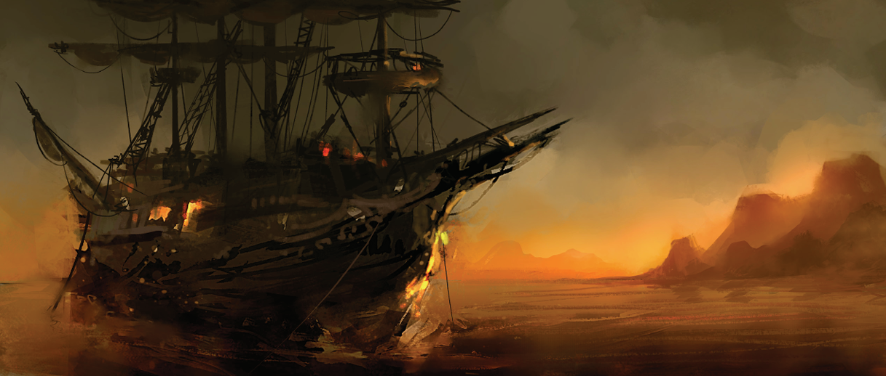

# PCs (souls belong to Asmodeus now)

- Borivikas, Aasimar, Eldritch Knight Fighter 5
  - The color of your sleep is 
red: blood, fire, burning rage. You don’t dream—
not in the normal sense. When you close your 
eyes, all you see is red. You wake bathed in sweat, 
with your heart pounding, but you can’t remember 
any details beyond that single color. Red. 
- Aerion, Aasimar, Wild-Magic Sorcerer 5
  - You have strange dreams 
not connected to your life. In them, you're a lowly 
servant … yet somehow your sister is the Queen, 
and she is beloved. Other servants, guards, dip
lomats, members of the court—they all go on and 
on about how smart she is, how beautiful, how 
perfect, while you toil in the shadows, forgotten 
and ignored.
- Bedzius, Aquatic-Elf, Soulknife Rogue 5
  - You were once a master 
of deceit, but in your dreams you're trapped in a 
labyrinth of your own lies, forced to run through 
the maze while being hunted by shadowy enemies 
and never able to find a way out.
- Solarius, Human, Light Domain Cleric 5
  - Your dreams are filled 
with the endless counting of gold coins—hun
dreds, thousands, millions, all piled in an enor
mous chamber. Each one must be counted by 
hand, and you can’t stop until you’re done … but 
the mountain of coins just continues to grow and 
grow. Worst of all, you know in your heart they 
aren't even yours; you're just counting them for 
someone else.

## Session log

- [Sesija 1 - 2026-06-12](https://github.com/thexzmeh/dnd/tree/main/sesija1)
- [Sesija 2 - 2026-06-19](https://github.com/thexzmeh/dnd/tree/main/sesija2)
- [Sesija 3 - 2026-??-??](https://github.com/thexzmeh/dnd/tree/main/sesija3)

## Renown

| Faction | Renown |
|---------|--------|
|Lord's Alliance |3|
|Zhentarim       |0|
|Harpers|3|
|Order of the Gauntlet|0|

## Vehicles

- ~~Aboard mercenary galley "Voyage" owned by White Sails Company, rented out by Lord Neverember.~~
- [Longship](https://5e.tools/items.html#longship_xphb) pavadinimu "???" su isdrozinetu/a "???" laivo priekyje su 40 berzerkeriu igula (crew wages 2gp/each - 80gp/day).

## Bastions

None

---

# Campaign introduction

Neverwinteris tik neseniai vėl atsistojo ant kojų. Po vulkano išsiveržimo, prasivėrusios bedugnės į Underdark ir orkiškos atakos, lordui Dagultui Neveremberiui pavyko įžiebti viltį Neverwinteryje. Išorinės sienos vėl atstatomos, rajonai pildosi gyventojais, o gyvenimas grįžta į buvusią šlovę, kuri kadaise miestui pelnė Šiaurės Brangakmenio titulą.

Deja, niekas nebūna tobula. Piratų išpuoliai prieš prekybinius laivus, keliaujančius į Neverwinterį ir iš jo, mieste kelia sumaištį: verslai žlunga, dingsta svarbūs maisto ir karinių atsargų kroviniai, o gyventojai vis labiau nerimsta. Dauguma miesto kariuomenės šiuo metu dislokuota karo laivuose, tikėdamasi atgrasyti arba, dar geriau, sučiupti plėšikus.

Lordas Dagultas Neveremberis yra svarbios Sword Coast frakcijos — Lordų Aljanso — narys. Ši kilmingųjų grupė dirba išvien, kad užkirstų kelią grėsmėms, kol jos netapo rimtesnės nei menkas nepatogumas.

Pastaruoju metu piratai su nauju įkarščiu puldinėja pakrantės miestus ir kaimus, o dauguma Aljanso karių išsklaidyti po visą regioną. Ypač sudėtinga padėtis Gundarlune. Būdama salų valstybė, ji turi nedaug karių, o ir tie išsiųsti padėti ginti Sword Coast miestus.

Prieš kelias dienas Gundarluno karalius Olgravas Raudonkirvis pranešė apie neramumus kitoje salos pusėje, tačiau vietoje nebėra karių ir herojų, galinčių tai ištirti.

Jūs, rytoj, išplauksite iš Neverwinterio į Gundarluną laivu, vardu "The Voyage".

