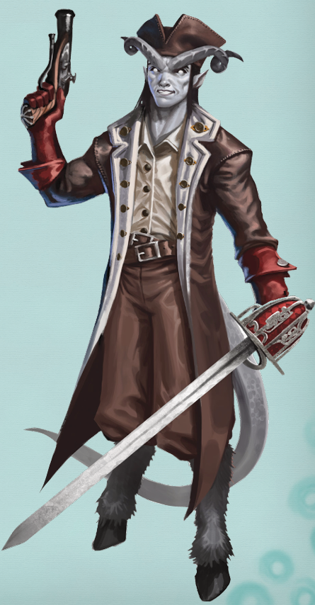
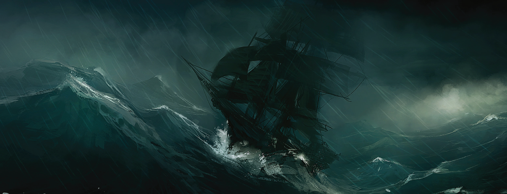
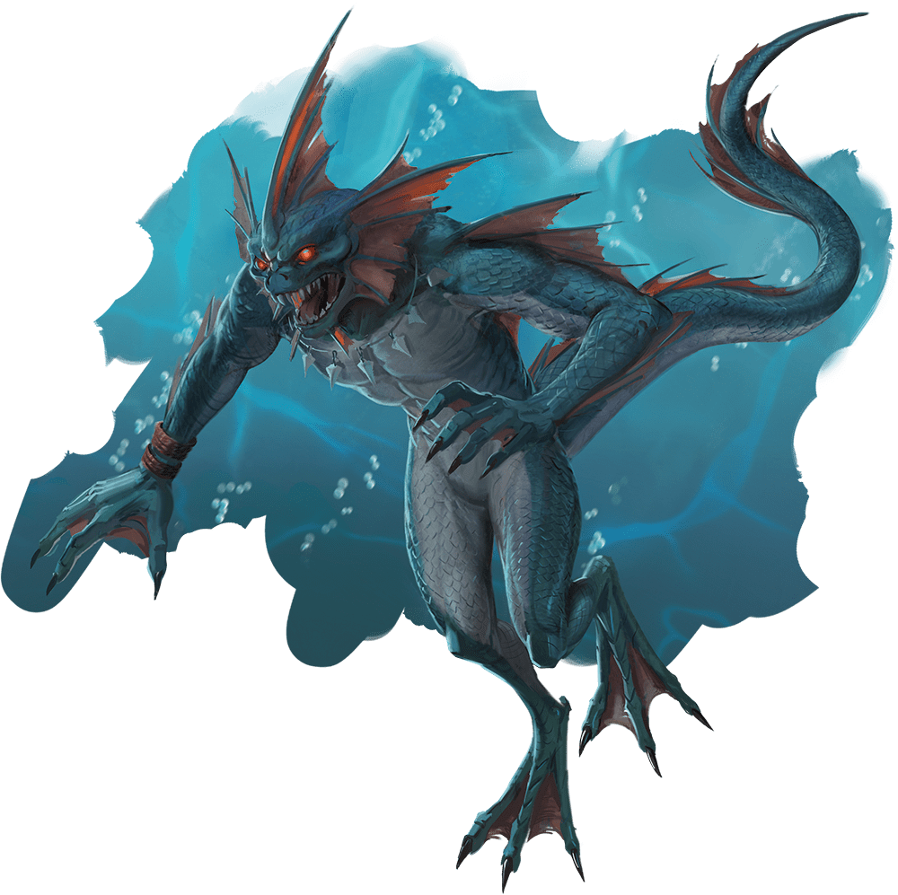
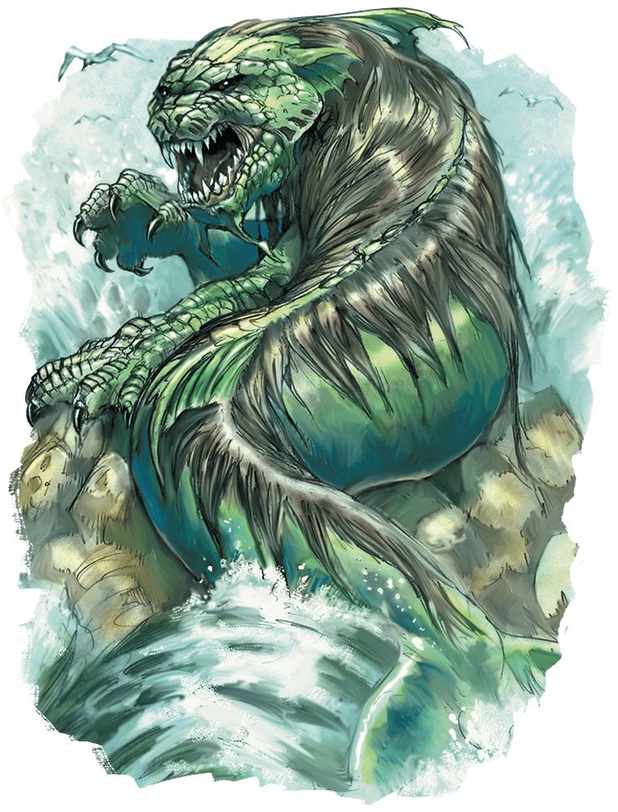
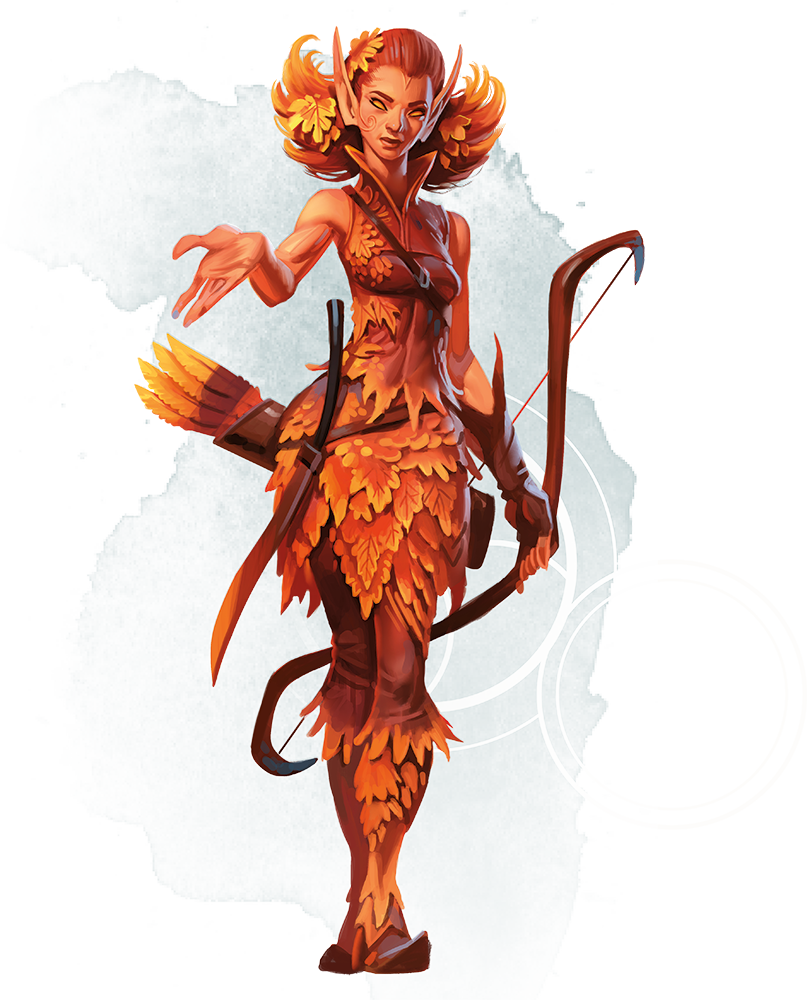
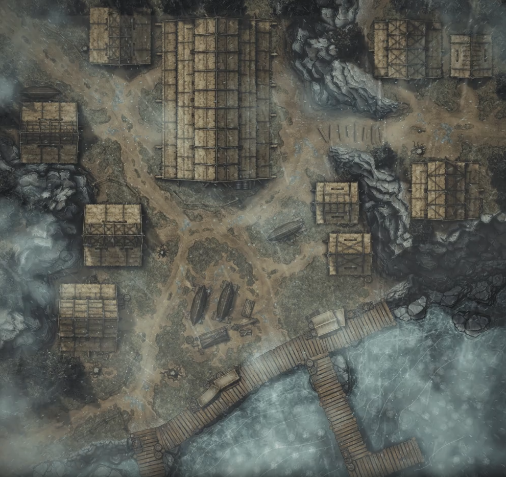

# Sesija 2

Kelione is Neverwinterio prasidejo nesekmingai. Vos po vienos valandos isplaukus is uosto, laivas buvo uzpultas piratu, su juoda veliava ir raudonu trikampiu per viduri - Devyniu Pragaru vyriausiojo velnio simboliu - Asmodejaus. Kapitonas Kalibras saude su pragarisku pistoletu uztaisomu Soul Coin'ais ir mete sprogstamas bombas po kojomis, taciau Aerionas, Bedzius, Solarius ir Barivikas atmuse uzpuolusius piratus. Keleta paeme i nelaisve, taciau pats Kapitonas Kalibras misty step'ino atgal i savo laiva.

Vienas is paimtu i nelaisve piratu buvo suristas ir ismestas uz borto, o kitas viska issipasakojes gramde deni. Pralietas kraujas, bet ismestas per borta piratas pritrauke dideli rykti, kuris trenkesi i laiva priverdamas iskristi per borta keleta heroju bei igulos nariu. Taciau Bedzio pasiaukojanciomis pastangomis pavyko visus sekmingai isgelbeti, kol Barivikas vandenyje taskesi su rykliu ir Aerianias galu gale rykli uzmigde.

Sustiprejus rukus ir atejus nakciai nieko nesimate ir Bedzius emesi pirmo budejimo. Visiems sugulus, staiga pasigirdo harpiju dainavimas, keleta jureiviu, tame tarpe ir Barivikas buvo uzkereti. Uzhipnotizuoti jie judejo link dainos saltinio ir iskrite is laivo plauke garso link. Siaip ne taip komandos pastangomis, ji pavyko isgelbeti, bei nugaleti harpijas.

Sekancios keliones dienos nebuvo tokios itemptos kaip pirmoji. Laivas prasilenke su Flaming Fist'u samdiniu laivu patruliuojanciu juroje ir gaudanti Kapitona Kalibra. Merchantu laivas neturejo irgi jokiu geru ziniu.

Herojai tuo tarpu bendravo su igulos nariais ir uzsiiminejo saviveikla, kas rase scroll'a, kas zaide kortomis, kas "piese zemelapius". Solarius buvo pakviestas uzsukti i Order of the Gauntlet bustine kai gris is keliones, o Bedzius prieme uzduoti is vieno is Zhentarim agentu apziureti Karaliaus Raudonkirvio pili.

Priartejus prie Gundarluno, paskutine keliones diena prasidejo didziole audra, stiprus vejas ir smarkus lietus. Taciau tai nesukliude Aerianui per ziurona pastebeti nedidelio laivelio pluduruojancio ant vandens. Bet tai pasirode tesas masalas, nes plaukiant link jo, i laiva susoko ir uzpuole saguahinai.

Jureiviams tai pasirode neiprasta, nuo kada sahuaginai kazka ima i nelaisve? Nuo kada jie puldineja didelius laivus? Isgelbetas paauglys Bern'as jiems negalejo atsakyti. Bern'as minejo, kad su tevais sau ramiai zvejojo netoli Fiskrbark'o, kai buvo uzpulti juros velniu. Sahuagino skrynioje aptiko ryklio staba, kurio pelekai buvo nulauzti ir israizytas keistais nesuprantamais simboliais. Staba palietus, herojai pamate vizija, kai ciuptuvas apglebia si staba ir nulauzia jo pelekus.

Atvykus i Gandarluna, Kapitone Pilkabure nuplukde laiva i dirbtuves, kad ji sutaisytu. Pasitikes karaliaus pasiuntinys pranese, kad herojai ramiai pailsetu, pavalgytu ir atsigautu po sunkios keliones ir i pili ateitu sekancia diena. Savaime suprantama pirma stotele buvo vietine krautuve-sandelys. Ismaine surinkus ginklus ir ivairias brangenybes i pinigus ir kitus jiems naudingus daiktus, taip pat uzejo gilyn i krautuves vidu pas mociute Saltwood, kuri gali pagaminti ir Potion of Water Breathing.

Mociute paprase specialiu rudu juros zoliu, kad ji galetu isvirti potionus, taciau ju galima rasti tik netoliese esancioje Pakaruoklio uoloje. Palike Bern'a uzeigoje, veikejai sokinedami akmenuota pakrante nuo akmens ant akmens patrauke uolos link. Nusileidimas uolos krastu nebuvo pats sekmingiausias, Barivikui truko virve. Uoloje miegojo juru liutas su Hag Eye amuletu ant grandineles uzkabintu ant kaklo.

Panasu, kad neveltui uola vadinasi pakaruoklio - berenkant juros zoliu derliu Aeriana uzpuole vaiduoklis - spektras. Spekta iveikus, Solarius pasventino ir panaikino sia isniekinta zeme apemusi prakeiksma. Idemiau apziurejus ir istyrinejus uola, veikejai aptiko netikra siena. Atstume netikra siena, kambaruje buvo ivairiu daiktu - besiraizgancios virviu rites, statines dvokianciu dumbliu, melynos sviesos zibintas, stikliniu indu su konservuotomis zuvimis, narvai su kaulais, bei pora kriauklemis apaugusiu skryniu.

Nors ir aisku, kad viena is skryniu yra magiska, taciau veikejai neturejo jokiu galimybiu, kaip tuos burtus panaikinti, todel pasiunte Bedziu i prieki jos atidaryti. Deja skrynia buvo uzkereta. Durys uzsidare, virves atgijo ir bande suciupti herojus, o kambarys emesi pildytis vandeniu. Prisipildzius dviems trecdaliams kambario, veikejams pavyko durys atidaryti ir isvengti spastu. Juos pasitiko prabudes juru liutas, taciau dideliu problemu nesukele.

Skryniose rado savo veikeju medines kopijas, kurias palietus imdavo pasaipiai kartoti nesenus heroju veikmus. Taip pat, buvo ir keletas spell scroll'u, Cloak of Manta Ray, Bag of Tricks (tan), didziulis perlas ir panasiai.

Gryze atgal atidave mociutei juru zoles ir dumblius, o ji prizadejo, kad rytoj buvo isvirti ir paruosti Potions of Water Breathing. Po dar vienos ilgos dienos apsistojo Drakono Vezlio uzeigoje herojai ramiai sau isilasino, sociai pavalge ir pabendravo.

Zmones pasakojo ivariai - vieni minejo, kad laivas suduzo isplaukes is juros, antri - is dangaus, treti - islindo is zemes, treti - is prasiverusiu pragaro vartu. Taciau, kad ir kas is tikruju atsitiko, visi bendrai sutaria, kad mire ir dingo nekalti vietiniai zmones.

Sekancia diena uzejo pas karaliu Raudonkirvi, kuris pasake, kad laivo nuolaiza, kuria jie ketina tirti yra nesaugi. Jarlas Serksnaguzis nera kvailas ir i fantazijas nera linkes, todel karalius yra linkes rimtai i sita reikala paziureti. Todel ir kreipesi Lordu Alliance pagalbos, kad padetu sita problema isspresti. Tuo tarpu Bedzius sniurinejo po pili, o Aerionas pasiskunde kriviui, kad jam kazkas atsitiko negerai. Krivis atlikes apeigas nustate, kad Aerionas yra prakeiktas, nuziuretas pikta akimi. Aeriono visa oda atrodo lyg butu ilgai mirkusi vandenyje.

Antroje dienos puseje patrauke Fiskrbark kaimelio link. Netoli pirmos keliones dienos stovyklos, nakti, pastebejo apleista ir isniekinta Salune pakeles sventa vieta. Pravalius ir atidengus statula menulio sviesoje nusvito, dekodama herojams.

Antra keliones diena pasirode idomesne. Beeinant keliu veikeja isgirdo gaudyniu ir kriuksejimo garso. Tai buvo sernas besivejantis halflinga - Litenanta Nescaffier'a. Dar betruko to, kad ji vijosi ir Manticore'as. Pasirodo istorija buvo tokia, kad halflingas, izymus sefas norejo pagaminti patiekala is mantikoro kiausiniu, todel atvyko su keleta draugiu i Gundarlanu ju ieskoti. Rado 2 kiausinius, bet deje ne tuos kokiu jam reikejo.

Draugai buvo isvaikyti, saules elfe mantikoras imete i jura, eladrina pagavo kalnu milzinai, o pati halflinga nusivijo sernas. Herojai su Nescaffiero pagalba grryzo atgal i mantikoro urva ir ji pribaige. Tarp auku kaulu ir drapanu, rado Rival Coin'a.

Po to, veikejai paseke milzinu pedsakais, suorganizavo diversija pasinaudodami Bag of Tricks. Kol milzinai tikrino kas vyksta, Bedzius patikrino maisus ir isgelbejo Teresa. Laimei is antro maiso Bag Jelly neistrauke.

Atsidekoma Teresa iteike Harper Pin ir pasake, kad jus visada busite laukiami Tukstancio veidu uzeigoje neverwinteryje, jeigu kas, iteikite sita pin'a ir jus priims. Halflingas ir Eladrin dar karta padekojo uz pagalba ir patrauke savais keliais, visu pirma atsigauti ir toliau ieskoti drauges saules elfes.

Mediniu nameliu centre stukso didziule, siaudais dengta puotu sale. Jos durys papuostos milziniskais kazkokio siaubunisko ryklio nasrais, toliais dideliais, kad galetu praryti zmogu vienu kasniu.

Kas tie svetimsaliai mano saleje? - jarlas suriaumoja per visa mene.
Jei esate draugai, seskit prie mano stalo ir isgerkite alaus.
Jei priesai - pasirinkote gera diena mirciai.

Tikslas jau visai netoli, ta nelemta nuolauza bera keliu valandu atstumu nuo heroju...

