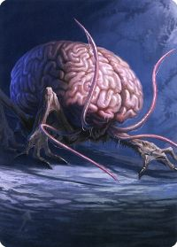
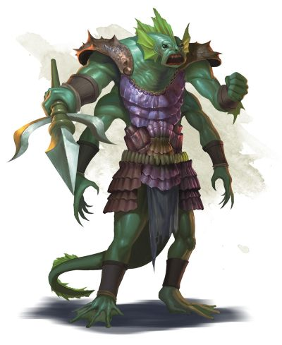
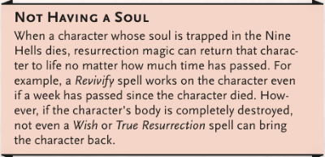
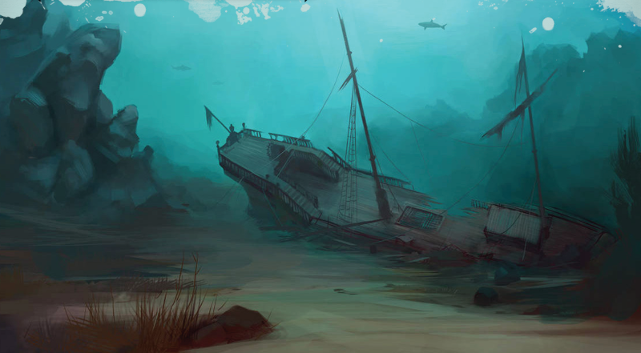
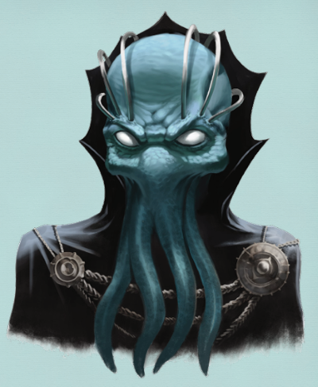
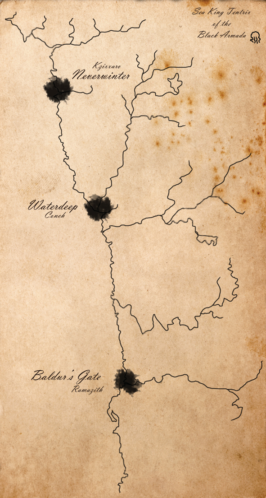

# Sesija 2

Po pasnekesio su Jarlu Serksnaguziu, herojai patrauke apziureti laivo nuolauzos. Panasu, kad vietiniai kaimelio gyventojai sake tiesa - tai buvo laivas nukrites is dangaus. Mind Flayeriu laivo nuolauza. Pirmuju atejusiu is arti apziureti nelaimes kunai vis dar gulejo salia laivo. Panasu, kad jie mire nuo minties atakos. Laivo viduje aptiko Intellect Devourer uzvaldyto Githyanki knight'a, kuri nukovus, is jo galvos issprogo devoureris laukan ir bande pabegti, taciau buvo Aeriono nusmeigtas su ietimi. Taip pat, laivo viduje susidure ir su Cranium Rats - ziurkes turincias stipras minties galias, galincias uzvaldyti bet ka. Tos ziurkes buvo uzmigdytos ir sumestos i jau mirusiu buozgalviu baseinus. Deja, vienas is baseinu kritimo metu suduzo ir issiliejo i jura.

Po to, veikejai nuseke juros velniu pedsakais palei pakrante kur kelias issiskirste i dvi dalis. Visu pirma nuprende patraukti juros link, kur matesi seniai suduzusio laivo stiebas ir zinojo, kad ten bus isikure juros velniu lizdas. Aerionas pirmasis nuplauke apsniukstineti ta laiva, taciau susidure su aplink plaukiojanciais sahuaginais ir parbego atgal i kranta pas savo draugus. Susitare visi 4 nere i salta ir tamsu juros vandeni nuplauke kartu link paskendusio laivo. Ten susidure su pulku sahuaginu ir pora ju rykliu.

Po sekmingos kovos pradejo apziureti visa laiva pradedant nuo virsutinio denio. Kapitono kajute buvo uzraizgyta grandinemis, kad kazko is ten neisleistu. Bet tai tik dar labiau pakurste heroju smalsuma ir jie prasibrove i vidu. Viduje rado gulincia seno burtininko mumija, vardu Hoch Miraz, kuris tik prabudes sove i juos cone of cold ir uzsipuole kaltinti ir klausti ar jie pavoge jo lazda ir kur ji dingo?! Visiems kartu pavyko burtininka nuraminti, kuris po pasnekesio isplauke laukan ieskoti savo staff of the magi.

- silver githyanki greatsword
- damaged githyanki armor (14AC, plate armor)
- flash of brine water from elder brain pool

Prisirinke ivairiausiu daiktu, veikejai nere dar gilyn i vidurini laivo deni. Ten sutiko keleta apsigyvenusiu padaru, tokiu kaip didelis elektrinis ungurys ar astuonkojis. Taip pat, rado ir lobiu kambari, is kurio Aerionas veliau pasieme ir visa ranku pilna skrynia. Vidurinio denio laivo priekyje rado ir sahuaginu barona isijautusi beskaptuojanti su nagais astuonkojo ar kalmaro skulptura su ciuptuvais. Aisku, jo kambario durys buvo mimic'as todel prasidejo intensyvi kova, kurios metu daug kartu krito visi herojai. Deja, sahuaginu baronui nepasiseke, herojams, panasu, kad padejo ir pragaro liepsnos. Kai jau atrode, kad veikejai bus suciupti, jie ispaskutiniuju jegu uzsimojo ir kartu pribaige barona.

Pragaro liepsnos nebuvo uz dyka, teko atsiduoti savo giliausioms vidinems ydomis parduodant siela Asmodejui. Uz tai, veikejai buvo "apdovanoti" antru sansu, bei keleta kitu antgamtisku dovanu:
- Galite sucastinti 2lvl Hellish Rebuke 1/long
- Advantage vs death saving throws

Nors ir pavarge, susale, vistiek tese laivo apziura. Apatiniame denyje rado isniekinta ryklio dievo sventykla, kurioje garbingiausioje vietoje buvo padetas mind flayaeriu gamybos skydas su akimi. Taip pat, rado ir paimtus ikaitus laikomus oro burbule. Tai buvo Bern'o mama, piratas isplaukes valtimi i jura del lazybu, bardas ieskojantis laimes, bei jau sutiktuju halflingo ir teresos drauge sun elfe Tharilea. Tarp sausai laikomu ikaitu daiktu, herojai atrado ir labai sekmingai issifravo black armada puolimo plana, kuris pazymejo tris miestus - neverwinter, waterdeep ir baldur's gate. Salia miestu pavadinimu buvo parasyti ir tikslai. Nurodymus dave juru karalius Tentrix'as. Panasu, kad mind flayeriai, sahuaginai bei piratai veikia is vien - taciau neaisku nei kaip ir kodel.

- spotless portrait of a female Calishite ship's captain with abjuration aura that prevents it becoming dirty (750gp)
- spyglass (1000gp)
- gem of seeing
- rotten pouch containing 435gp in assorted coins
- diamond (300gp)
- Hoch Miraz spellbook (conjure elemental, stone shape, fabricate)
- potion of vitality
- 3x potion of greater healing
- potion of mind reading
- 6x gold ingots (10gp/each)
- 8x adamantine ingots (10gp/each)
- 3x pearl and coral necklace (50gp/each)
- 2x idol carved from whalebone (15gp/each)
- 3x potion of healing
- potion of animal friendship
- 1400cp, 190sp, 30gp, kuriuos reiketu nuvalyti
- leather mariner's armor
- cube of force (iskiles, reikia pataisyti)
- 13x amuletu su ivairiomis dievybemis (5gp/each)
- 3x small gold bracelets with dwarven motifs (25gp/each)
- engraved bone dice (30gp)
- gold ewer covered in elvish lettering (100gp)
- skrynia pilna ivairiu ranku
- shield of far sight
- 6x stones scrawled with arcane runes for bubble of air
- black armada attack map

Isgelbeje ikaitus, bei isvale auksines karunos laiva nuo jurios velniu herojai gryzo atsipusti ir atgauti jegas. Pailseje sekancia diena nutare keliauti dar apziureti Berranzo uzkeiktosios kasyklos, kuri veike pries 100 metu, taciau greitai uzsidare, nes visi ten dirbe isprotedavo.

Iejimas i kasykla buvo uzgriuves po neseniai ivykusios audros, taciau komandiniu darbu, bei ypac Bariviko dideliu jegu pastangomis prasibrove i vidu. Kasyklose rado dirbanti mind flayeri, kuris tobulino sau vergus bei kazka gamino is pagrobtuju smegenu. Kova buvo labai trumpa, bet invensyvi. Mind flayeris saude mind blast'us, o herojai is paskutiniuju stengesi ji nugaleti. Taciau pritruko labai nedaug, paskutines kelios atakos buvo atmustos ir tai leido ateiviui phase shiftinti lauk.

Kasykloje dar susidure su ten keliais gyvenanciais padarais, tokiais kaip grick'as ar rust monsters. Grick'as greitai sukapojo, o ant rudziu monstru uzstume ir uzridejo kruva kasyklos vezimeliu pilnu akmenu ir juos taip sutraiske. Tai leido herojams netrukdomiems nusileisti gilyn i kasykla bei apziureti kalve. Kalveje miegojo ugnies elementalas, taciau jam nespejus prabusti ir isiaudrinti veikejai istempe kalveje buvusia skrynia ir saugiai uztrenke duris, apsaugotas runomis, kad ugnies elementas neistruktu.

Susirinke vertingus daiktus herojai gryzo atgal i fiskbarka. Jarlas iskele puota ir apdovanojo juos 500gp. Barivikas puikiai apdainavo ju zygdarbius. Gryzus atgal i sostine, karalius Raudonbarzdis taip pat iskele didziule puota bei leido issirinkti sau bet koki patiksianti longship'a is jo flotiles.

- 12x iron ingots (1gp 10lbs/each)
- 3x gold ingots (10gp 10lbs/each)
- 4x smith's tools (20gp/each)
- jeweller's tools (25gp)
- 6x agates (10gp/each)
- 4x chalcedonies (50gp/each)
- 2x potion of healing
- potion of climbing
- potion of diminution
- potion of water breathing
- +1 dagger with an adamantine wyvern engraving on the blade
- driftglobe
- vial of drow poison
- 231gp in assorted coins
- 4x adamantine ingots (10gp/each)
- 2x amethysts (100gp/each)
- healer's kit
- 3x flasks of oil
- alchemist supplies
- survival mantle
- +1 adamantine longsword
- mithral chain shirt
- brooch of shielding

