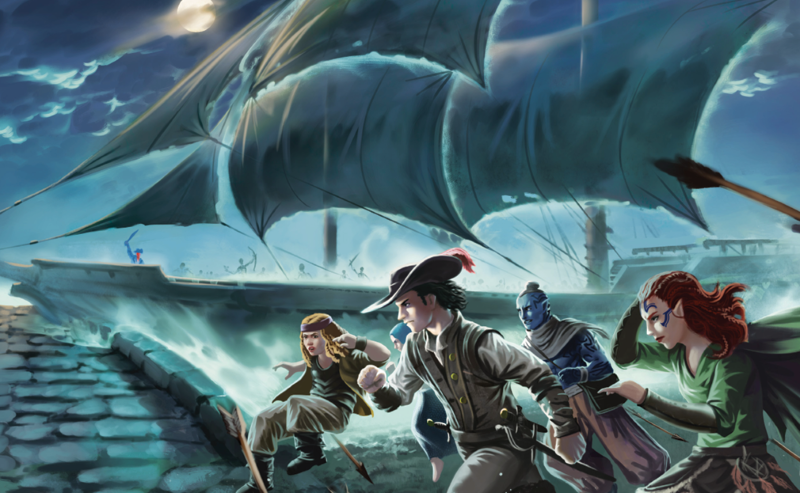
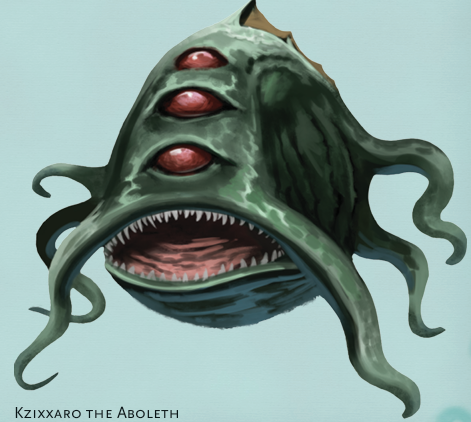
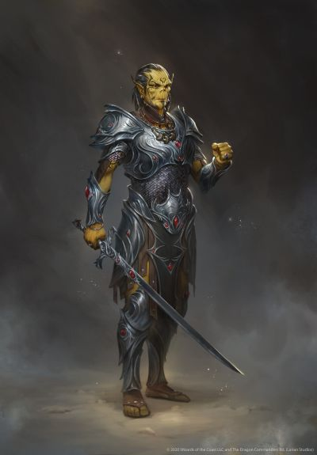

# Sesija 3

Parplauke atgal be jokiu didesniu ivykiu su nauju longship laivu. Du plaukiantys laivai neatrode toks geras taikinys piratams. Pakeliui uztiko tik viena sudusuzi ir nuskendusi laiva. Tarp nuolauzu pluduriavo tik viena Kelpie, kuri apsimetinejo paskenduoliu, jokiu kitu gyvuju nepavyko rasti. Netoli neverwinterio sutiko patruliuojancius sea elfus ant delfinu is Tralquanaaro, esancio netoli waterdeepo. Niekas nesusidomejo is delfinu pasidaryti mountus.

Gryzus, uoste sutiko Len-Jes water genasi harbormastere, kuri papasakojo taisykles. Viena is ju - 10% mokesciu uz parduodamas prekes ir daiktus, kurie butu skirti miesto atstatymui. Bedzius per pazystamus Zhentarim fence'us paslapcia pardave visa ju surinkta lobi, kad nereiketu tu mokesciu moketi. Tada nusprende uzsukti i Aurora's Emperiuma ir isleisti tuos auksinius. Emperiume panasu, kad pasikeite management'as, dabar ten vadovauja Shandar'as su isvirksciomis rankomis. Ten paeme 50gp dienpinigiu (subscriptiona), kad herojai, galetu prieiti prie prekiu katalogo, bei pasinaudoti tarpininku paslaugomis parduodant magiskus daiktus. Pardavimui paliko - Harper Pin, Mariners Leather Armor, Mithral Chain Shirt, bubble enchanted akmenys, wizard knyga.

Tada apsilanke sugriuvusio boksto uzeigoje. Ten Bedzius pabendravo su savo Zhentarim sebrais, o tuo tarpu Solarius pastebejo sena akla orke (orc claw of luthic), kuri uz dovanas atlikinedavo magiskus ritualus. Solarius dave pinigu orkei, kad ji ir jiems isburtu apie ateinancia ataka. Orke apimta transo busenos ant zemes isbraize siuos simbolius - ship skull scroll moon sun - kuriuos pavyko sekmingai interpretuoti, kad bus puolami Oghmos ziniu namai.

Vakare, pasiklausineje mieste, kas uzsiimtu magisku daiktu taisymu buvo nukreipti i Apsiaustu boksta. Ten nykstuke iliuzioniste Mardrede atkurusi magu ordina gamina ir taiso ivairius magiskus daiktus. Aeorianas sutare, kad ji pataisys Cube of Force - turetu uztrukti apie savaite.

Sekancia diena pasiruose piratu antpuolio gynybai. Suorganizavo sargybinius su Dagulto Neveremberio palaiminimu. Deja piratai buvo pasirode esantys vaiduokliski ir visus ginybinius itvirtinimus perplauke kiaurai. Vienas is piratu laivu kiaurai perplaukes ir visus tiltus atsidure prie Oghmos ziniu namu. Nuskubeje ten, veikejai rado jau islauztas duris vedancias i pozemi, kur savo irstva pasirodo yra isikures Aboleth - Kzixxaro. Nors aboleth ir bande kartas nuo karto veikejus uzvaldyti mintimis, taciau herojai vistiek ji apgyne nuo vaiduoklisku piratu. Uz tai, lordas Neveremberis apdovanojo herojus didziuliu dvaru, kuri herojai gales naudoti kaip savo bastiona.

Sekmingai apgyne miesta ir aboleth nuo uzpuoliku veikejai pailsejo. Mieste pasklidus ziniai apie ju gerus darbus, harperiai kreipesi pagalvos. Kultistai uzeme harperiu baze esancia pluduruojanciame ledkalnyje, kuri yra naudojama kaip ankstyvaus perspejimo sistema piratu atakoms. Is po tukstancio veidu tarvernos rusio per teleportation circle herojai buvo perkelti i ledkalni. Ten jie lengvai susitvarke su kultistais ir yeciais islaisvino ten esancius ikaitus.

Persikelus atgal ir vos spejus atsipusti, staiga pries juos pasirode Mardredes iliuzija, kuri paprase skubios pagalbos, nes jos boksla tika uzpuole. Nubegus i Apsiaustu boksta, pamate, kad ji uzpuole githyankiai. Sumusti ir isgasdinti burtininkes padejejai buvo grasinami mirtimi, jeigu Mardrede neatiduos savo sukurtu Robe of Stars. Githyankiai, sake zinantys apie nukritusi mind flayeriu laiva, todel jiems ir reikia Robe of Stars, kad pasiruostu juos pulti ir jeigu mind fleyeriai begs i astral plane'a - galetu juos sekti (plane shift). Herojai susitvarke su sia situacija be smurto - perdave githyankiams Silver Sword, kuri buvo rade mind flayeriu laive bei pasidalino po 2 apsiaustus. 2 apsiaustai atiteko githyankiams ir 2 veikejams. Nors ir norejo juos grazinti Mardredei ji patikino, kad gali pasilikti apsiaustus uz isgelbetas ju gyvybes. Patys githyankiai uzsimine, kad jie gyvena Flame Fault'e jeigu noretu kartu pulti mind flayerius ar siaip pabendrauti.

