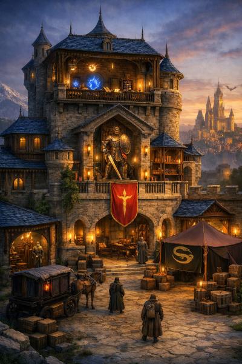
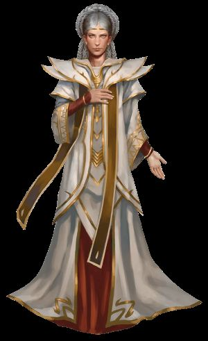
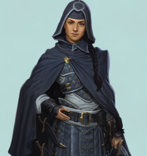
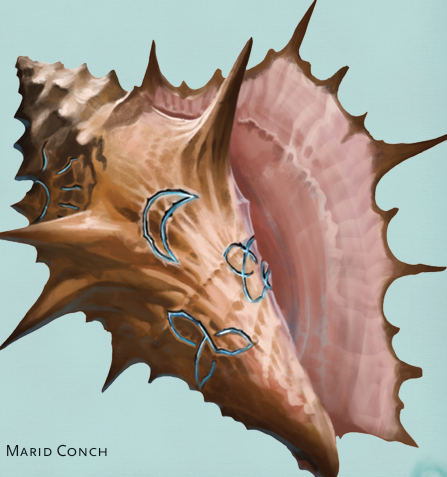

# Sesija 4

Isikure ir apziurejo savo bastiona herojai dave nurodymus samdiniams, kad:
- pasiklausinetu ir rinktu informacija apie Luskan miesta (Zhentarim Travel Station)
- gamintu Arcane Focus (Arcane Study)
- uzpirktu ginklu i saugykla (Armory)
- gamintu Sacred Focus (Sanctuary)

Sumokejo berserkeriams, kad plaukti i Waterdeepa su laivu, o patys pasinaudojo harperiu telerpotation circle, kad ten nusigautu iskart.

Uz pagalba, harperiu tinklas leidzia pasinaudoti ju turimais teleportation circle, tarp situ miestu:
- Mirabar
- Neverwinter (tukstancio veidu uzeiga)
- Waterdeep (waterdeep pilis)
- Baldur's Gate

Nusikele i waterdeepa, netiketai atsidure waterdeepo pilyje. Ten juos iskart palydejo pas Open Lord Laeral Silverhand, garsiaja burtininke, penkta is septyniu Mystros dukru. Uzsiminus apie artejanti uzpuolima ir papasakojus apie nutikusios ivykius, pasimate, kad Laeral jais tiki ir pasitiki. Silverhand pasake, kad kaip tik pries kelias dienas, i ja kreipesi vienas prekybininkas Pasha, del pavogtos seimos relikvijos - kriaukles.

Nukeliave i Pashos dvara ir apziureje vagystes vieta jokiu isilauzimo pedsaku nepastebejo. Apklausus tarnus paaiskejo, kad paskutinis asmuo kazka dare ar matytas netoli kriaukles buvo sunus Haseinas. Stipriau paspaudus Haseina, jis prisipazino, kad suviliotas vienos merginos, jis nusisene kriaukle i Tymoros palaiminimo uzeiga, kur buvo nugirdytas ir is jo kriaukle buvo atimta.

Nuejus i Tymoros palaiminomo uzeiga, prie duru sutiko apsaugininka hill gianta, kuris supazindino juos su taisyklemis - viduje negalima naudoti jokios magija ar magisku daiktu. Iskart suveikia burtas aliarmas, o daikta buna sunaikinti (dezintegruoti), kad niekas nesukciautu ir nekeltu problemu. Bedzius pastebejo zhentarim draugus, kurie viska papasakojo kas ivyko istikruju. Zhentarimai turi susitarima su sios uzeigos savininke ir visi magiski daiktai nera sunaikinami, bet nuteleportuojami i slapta vieta, kur zhentarimai juos tada parduoda. Uz 500gp kysi, zhentarim mergina papasakojo, kad buvo nusamdyta ta kriaukle gauti bet kokiais budais ir ja perduoti i queenspire sventykla.

Queenspire sventykla, skirta juru deivei - Umberlee. Tai didziule rozine susisukusi kriaukle apaugusi koralais ir kitais vandens augalais. Ten susitiko su Abelina Novakaro - vyriausiaja sventike (High Trident), bei slaptos organizacijos Kraken Society nare, su kuria susisieke krakenas - Slarkrethelis ir paprase jos pavogti ta kriaukle. Jeigu tos kriaukles taip reikia krakenui - kodel jis nepaprase tos kriaukles atnesti? Abelina butu tai padariusu su malonumu, kad tik pasitarnautu. Taciau vyksta, kazkas neiprasto. Kriaukle su skrynia buvo imesta i Umberlee povandenine saugykla juroje.

Veikejai uoste sutiko bronzini drakona - Zelifarna, kuris, is zmoniu beveik dorais bande isvilioti pinigus. Solariui parode, kad zaibas gali trenkti i ta pacia vieta du kartus. Pasinaudoje Zelifarno pagalba, nedideliu laiveliu nuplauke link tos vietos, kur nurode Abelina. Ten matesi svytintys koralai po vandeniu, vedantys uolos link. Herojai nere gilyn i ta urva. Ten srove vandens itrauke i vis siaurejanti tuneli, pakol buvo ismesti i didelia uola.

Uoloje plaukiojo trys spektrai piratai, po mirties tarnaujantys Umberlee uz ivykdytas nuodemes. Taip pat, is urvo islindo ir Bearded Devil. Panarsius giliau dar sutiko ir Tribute Gatheriuis - zalius astuonkojus su ragais ir juoda rugstini ooza. Visi sie padarai saugoja ir priziuri Umberlee saugykla, kur yra numetamos surinktos aukos.

Sekmingai iveike vietinius padarus, veikejai rado skrynia pilna perlu ir ta pavogta kriaukle. Kaip tik tuo momentu, atplauke sahuaginu burys. Panasu, kad dalis juros velniu puole miesta, grobe zmones, o dalis ju, butent atvyko susirinkti tos kriaukles. Baronas, priestai, kariai ir pora rykliu. Po sunkios kovos herojai triumfavo.

Pries isplaukiant, veikejai dar apiplauke kitas urvo vietas, kur nespejo apziureti. Vienoje meneje aptiko slapta altoriu, is kurio paemus magiskus scrollus, durys staiga uzsivere. Durys isskyre komanda - Aeorianas ir Bedzius liko meneje, o Solarius su Boriviku liko viduje. Viduje slapto altoriaus vanduo pradejo kaisti. Herojai stume, dauze, krapse, meldesi ir visais kitais imanomais budais bande atidaryti duris, taciau jiems nesiseke. Solarius ir Borivikas prarado samone, taciau paskutiniuoju bandymu Bedzius, padedamas Aeoriono laukines magijos pravere duris ir isgelbejo draugus.

Herojai gavo po 100gp uz perspejima apie puolima is Laeral Silverhand. Po pasakojimo kas nutiko saugykloje, Abelina pritare, kad butina issiaiskinti kas nutiko - ar niekas nepaveike ir itakojo jos kominikacijos su krakenu - butu gerai, jeigu veikejai ja palydetu i susitikima su kitais kraken society nariais i Cloakwooda.

